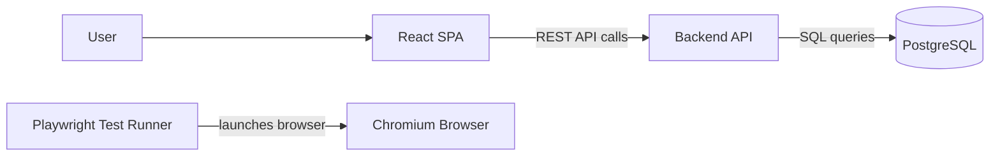

# Kanban Ticketing System

A Kanban-style ticket tracker built as a three-tier single-page application: a React SPA, a
TypeScript REST API, and a PostgreSQL database, all run in containers.

---

## A. What This App Is For

Kanban Ticketing helps teams organize work as tickets and move them through a fixed Kanban
workflow. Registered users sign in, group tickets by **team**, optionally organize them under
**epics**, and track each ticket across five workflow states on a draggable board:

```text
new → ready_for_implementation → in_progress → ready_for_acceptance → done
```

The goal is a small, complete, self-hosted ticket tracker that demonstrates a clear separation
between presentation, application/API, and persistence tiers. Scrum, sprints, SSO, and
advanced project-management features are intentionally out of scope.

For the full product specification see [docs/KanbanBoard.pdf](docs/KanbanBoard.pdf), and for
the planned solution see the [High Level Solution](docs/kanban-ticketing-hls.md).

---

## B. Functionality

The project is delivered in phases. The status below reflects what is actually built today.

### Implemented

- Three-tier containerized runtime (React SPA + Nginx, Express API, PostgreSQL 15).
- Local development stack via Podman / `podman-compose`.
- Backend health and readiness endpoints (`/api/health`, `/api/ready`) and a static API
  resource index (`/api`).
- A scaffold Kanban board UI (static placeholder columns, not yet backed by the API).
- A Playwright browser smoke test that verifies the app shell loads.

### Not Yet Implemented

- **Authentication** — sign-up, email verification, login/logout (planned: Phase 2).
- **Database schema & migrations** — no domain tables yet (planned: Phase 1).
- **Teams** — create, rename, delete, with deletion guards (planned: Phase 3).
- **Epics** — CRUD scoped to a team (planned: Phase 4).
- **Tickets** — full lifecycle, fields, and the five-state workflow (planned: Phase 5).
- **Comments** — chronological, immutable comments on tickets (planned: Phase 6).
- **Kanban board** — real drag-and-drop persistence, filtering, and search (planned: Phase 7).
- **Persistence-backed data** — the current board uses in-memory placeholder data only.

See the [phase-by-phase plan](docs/kanban-ticketing-hls.md) for the full roadmap and the
[Phase 1 plan](docs/phase-1.md) for the work in progress.

---

## C. How To Deploy

The stack runs in containers. On Windows it uses Podman with a WSL2-backed virtual machine.

### Prerequisites

- Podman
- `podman-compose`

The stack is intended to run with rootless Podman.

### Windows Setup (Podman + WSL2)

On Windows, Podman runs containers inside a WSL2-backed virtual machine. Set this up once.

1. Install Podman and `podman-compose`:

```powershell
winget install --id RedHat.Podman --exact
pip install podman-compose
```

2. Ensure Podman uses the WSL provider. Create or edit `%APPDATA%\containers\containers.conf`:

```toml
[machine]
provider = "wsl"
```

3. Install the WSL2 platform (requires administrator rights). Podman creates its own WSL distro, so no default distribution is needed:

```powershell
wsl --install --no-distribution
```

4. Reboot Windows. The Virtual Machine Platform feature only becomes active after a restart.

5. After reboot, verify the tools resolve in a new terminal:

```powershell
podman --version
podman-compose --version
```

#### Troubleshooting: `podman-compose` not found

`pip install podman-compose` performs a *user* installation, which places `podman-compose.exe` in your per-user Python scripts directory (for example `%APPDATA%\Python\Python314\Scripts`). If that directory is not on your PATH, both `podman-compose` and the built-in `podman compose` wrapper fail to find a provider:

```text
Error: looking up compose provider failed
        * exec: "docker-compose": executable file not found in %PATH%
        * exec: "podman-compose": executable file not found in %PATH%
```

First, confirm the executable exists and find its location:

```powershell
python -c "import sysconfig; print(sysconfig.get_path('scripts', 'nt_user'))"
```

Then add that directory to your user PATH permanently (adjust the Python version in the path if needed):

```powershell
$scripts = "$env:APPDATA\Python\Python314\Scripts"
$userPath = [Environment]::GetEnvironmentVariable("Path", "User")
if ($userPath -notlike "*$scripts*") {
    [Environment]::SetEnvironmentVariable("Path", "$userPath;$scripts", "User")
}
```

Open a new terminal (the permanent PATH change does not apply to already-open sessions) and verify:

```powershell
podman-compose --version
```

### Initialize The Podman Machine

With the WSL provider, these commands do not require administrator rights. Run them once after installation (and after a reboot on Windows):

```powershell
podman machine init
podman machine start
```

Confirm the machine is running:

```powershell
podman machine list
```

### Configure Environment

Runtime ports, database credentials, and test URLs are read from a local `.env` file at the repository root. Create it from the committed template before running the project:

```powershell
copy .env.example .env
```

On macOS or Linux:

```shell
cp .env.example .env
```

Update `.env` for your local machine. Do not commit `.env`; it is ignored by Git.

### Start The Application

Start frontend, backend, and PostgreSQL from the repository root:

```shell
podman-compose -f infra/podman/podman-compose.yml up --build
```

Then open the application in a browser:

- Frontend: `http://localhost:${FRONTEND_HOST_PORT}`
- Backend health: `http://localhost:${BACKEND_HOST_PORT}/api/health`
- Backend database readiness: `http://localhost:${BACKEND_HOST_PORT}/api/ready`

Stop the stack:

```shell
podman-compose -f infra/podman/podman-compose.yml down
```

Remove the PostgreSQL development volume:

```shell
podman-compose -f infra/podman/podman-compose.yml down -v
```

> Note: the product specification targets a single-command `docker compose up --build` from
> the repository root. A repo-root Compose entrypoint is planned in
> [Phase 1](docs/phase-1.md); until then, use the `podman-compose` command above.

---

## D. Other Useful Info

### Architecture



### Project Structure

```text
backend/             TypeScript REST API service
docs/                Specification, architecture, and phase plans
frontend/            TypeScript React Vite SPA
infra/podman/        Podman compose runtime
tests/e2e/           Browser smoke tests using Playwright in Podman
```

### Local Service Details

- `frontend` serves the built React app with Nginx and proxies `/api` to `backend`.
- `backend` exposes `/api/health`, `/api/ready`, and an initial API resource index.
- `db` runs PostgreSQL 15 using database settings from `.env`.
- `e2e` runs Playwright with Chromium for browser automation.

### Running The Browser Tests

Run the headless Playwright smoke test from the repository root:

```shell
podman-compose -f infra/podman/podman-compose.yml --profile test up --build --abort-on-container-exit e2e
```

This starts the required application services and runs the `e2e` container. Playwright launches Chromium headlessly inside the Podman container. Clean up the test stack:

```shell
podman-compose -f infra/podman/podman-compose.yml --profile test down
```

### Documentation

- [Product specification](docs/KanbanBoard.pdf) — the authoritative requirements (main doc).
- [High Level Solution](docs/kanban-ticketing-hls.md) — phase-by-phase implementation plan with tech solutions.
- [Phase 1 plan](docs/phase-1.md) — persistence foundation & migrations plan with a JIRA-style backlog.
- [Architecture](docs/architecture.md) — high-level architecture and delivery phases.
- [Auth/Teams/Epics plan](docs/implementation-plan-auth-teams-epics.md) — detailed plan for spec chapters 3–5.
- [Testing approach](docs/testing-approach.md) — grouped end-to-end scenario catalogue.
