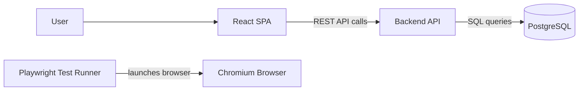

# Kanban Ticketing System

Kanban Ticketing is a starter TypeScript-first 3-tier application with a React SPA, REST API, PostgreSQL database, and Podman-based local runtime.

Current phase: Phase 1, foundation and runtime scaffold. The project currently has the TypeScript app skeleton, Podman runtime, PostgreSQL service, and Playwright smoke-test container in place.

## Architecture



See [docs/architecture.md](docs/architecture.md) for the high-level architecture plan.

See [docs/implementation-plan-auth-teams-epics.md](docs/implementation-plan-auth-teams-epics.md) for the implementation and testing plan for authentication, teams, and epics (spec chapters 3–5).

## Project Structure

```text
backend/             TypeScript REST API service
docs/                Architecture documentation
frontend/            TypeScript React Vite SPA
infra/podman/        Podman compose runtime
tests/e2e/           Browser smoke tests using Playwright in Podman
```

## Prerequisites

- Podman
- `podman-compose`

The stack is intended to run with rootless Podman.

## Windows Setup (Podman + WSL2)

On Windows, Podman runs containers inside a WSL2-backed virtual machine. Set this up once.

1. Install Podman and `podman-compose`:

```powershell
winget install --id RedHat.Podman --exact
pip install podman-compose
```

2. Ensure Podman uses the WSL provider. Create or edit `%APPDATA%\containers\containers.conf`:

```toml
[machine]
provider = "wsl"
```

3. Install the WSL2 platform (requires administrator rights). Podman creates its own WSL distro, so no default distribution is needed:

```powershell
wsl --install --no-distribution
```

4. Reboot Windows. The Virtual Machine Platform feature only becomes active after a restart.

5. After reboot, verify the tools resolve in a new terminal:

```powershell
podman --version
podman-compose --version
```

### Troubleshooting: `podman-compose` not found

`pip install podman-compose` performs a *user* installation, which places `podman-compose.exe` in your per-user Python scripts directory (for example `%APPDATA%\Python\Python314\Scripts`). If that directory is not on your PATH, both `podman-compose` and the built-in `podman compose` wrapper fail to find a provider:

```text
Error: looking up compose provider failed
        * exec: "docker-compose": executable file not found in %PATH%
        * exec: "podman-compose": executable file not found in %PATH%
```

First, confirm the executable exists and find its location:

```powershell
python -c "import sysconfig; print(sysconfig.get_path('scripts', 'nt_user'))"
```

Then add that directory to your user PATH permanently (adjust the Python version in the path if needed):

```powershell
$scripts = "$env:APPDATA\Python\Python314\Scripts"
$userPath = [Environment]::GetEnvironmentVariable("Path", "User")
if ($userPath -notlike "*$scripts*") {
    [Environment]::SetEnvironmentVariable("Path", "$userPath;$scripts", "User")
}
```

Open a new terminal (the permanent PATH change does not apply to already-open sessions) and verify:

```powershell
podman-compose --version
```

## Initialize The Podman Machine

With the WSL provider, these commands do not require administrator rights. Run them once after installation (and after a reboot on Windows):

```powershell
podman machine init
podman machine start
```

Confirm the machine is running:

```powershell
podman machine list
```

## Environment Configuration

Runtime ports, database credentials, and test URLs are read from a local `.env` file at the repository root.

Create it from the committed template before running the project:

```shell
copy .env.example .env
```

On macOS or Linux:

```shell
cp .env.example .env
```

Update `.env` for your local machine. Do not commit `.env`; it is ignored by Git.

## Run In UI Mode

Start frontend, backend, and PostgreSQL from the repository root:

```shell
podman-compose -f infra/podman/podman-compose.yml up --build
```

Then open the application in a browser:

- Frontend: `http://localhost:${FRONTEND_HOST_PORT}`
- Backend health: `http://localhost:${BACKEND_HOST_PORT}/api/health`
- Backend database readiness: `http://localhost:${BACKEND_HOST_PORT}/api/ready`

Stop the stack:

```shell
podman-compose -f infra/podman/podman-compose.yml down
```

Remove the PostgreSQL development volume:

```shell
podman-compose -f infra/podman/podman-compose.yml down -v
```

## Run Headless Playwright Tests

Run the headless Playwright smoke test from the repository root:

```shell
podman-compose -f infra/podman/podman-compose.yml --profile test up --build --abort-on-container-exit e2e
```

This starts the required application services and runs the `e2e` container. Playwright launches Chromium headlessly inside the Podman container.

Clean up the test stack:

```shell
podman-compose -f infra/podman/podman-compose.yml --profile test down
```

See [docs/testing-approach.md](docs/testing-approach.md) for the grouped e2e scenario plan.

## Local Service Details

- `frontend` serves the built React app with Nginx and proxies `/api` to `backend`.
- `backend` exposes `/api/health`, `/api/ready`, and an initial API resource index.
- `db` runs PostgreSQL 15 using database settings from `.env`.
- `e2e` runs Playwright with Chromium for browser automation.
