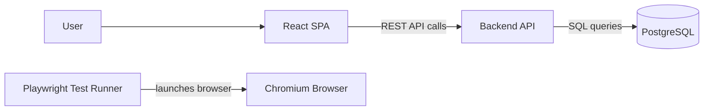

# Kanban Ticketing System

Kanban Ticketing is a starter TypeScript-first 3-tier application with a React SPA, REST API, PostgreSQL database, and Podman-based local runtime.

Current phase: Phase 1, foundation and runtime scaffold. The project currently has the TypeScript app skeleton, Podman runtime, PostgreSQL service, and Playwright smoke-test container in place.

## Architecture



See [docs/architecture.md](docs/architecture.md) for the high-level architecture plan.

## Project Structure

```text
backend/             TypeScript REST API service
docs/                Architecture documentation
frontend/            TypeScript React Vite SPA
infra/podman/        Podman compose runtime
tests/e2e/           Browser smoke tests using Playwright in Podman
```

## Prerequisites

- Podman
- `podman-compose`

The stack is intended to run with rootless Podman.

## Environment Configuration

Runtime ports, database credentials, and test URLs are read from a local `.env` file at the repository root.

Create it from the committed template before running the project:

```shell
copy .env.example .env
```

On macOS or Linux:

```shell
cp .env.example .env
```

Update `.env` for your local machine. Do not commit `.env`; it is ignored by Git.

## Run In UI Mode

Start frontend, backend, and PostgreSQL from the repository root:

```shell
podman-compose -f infra/podman/podman-compose.yml up --build
```

Then open the application in a browser:

- Frontend: `http://localhost:${FRONTEND_HOST_PORT}`
- Backend health: `http://localhost:${BACKEND_HOST_PORT}/api/health`
- Backend database readiness: `http://localhost:${BACKEND_HOST_PORT}/api/ready`

Stop the stack:

```shell
podman-compose -f infra/podman/podman-compose.yml down
```

Remove the PostgreSQL development volume:

```shell
podman-compose -f infra/podman/podman-compose.yml down -v
```

## Run Headless Playwright Tests

Run the headless Playwright smoke test from the repository root:

```shell
podman-compose -f infra/podman/podman-compose.yml --profile test up --build --abort-on-container-exit e2e
```

This starts the required application services and runs the `e2e` container. Playwright launches Chromium headlessly inside the Podman container.

Clean up the test stack:

```shell
podman-compose -f infra/podman/podman-compose.yml --profile test down
```

See [docs/testing-approach.md](docs/testing-approach.md) for the grouped e2e scenario plan.

## Local Service Details

- `frontend` serves the built React app with Nginx and proxies `/api` to `backend`.
- `backend` exposes `/api/health`, `/api/ready`, and an initial API resource index.
- `db` runs PostgreSQL 15 using database settings from `.env`.
- `e2e` runs Playwright with Chromium for browser automation.
