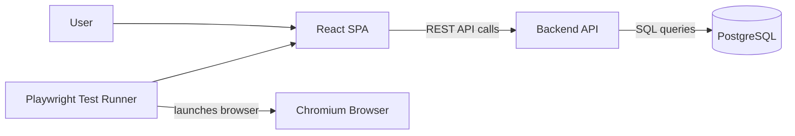
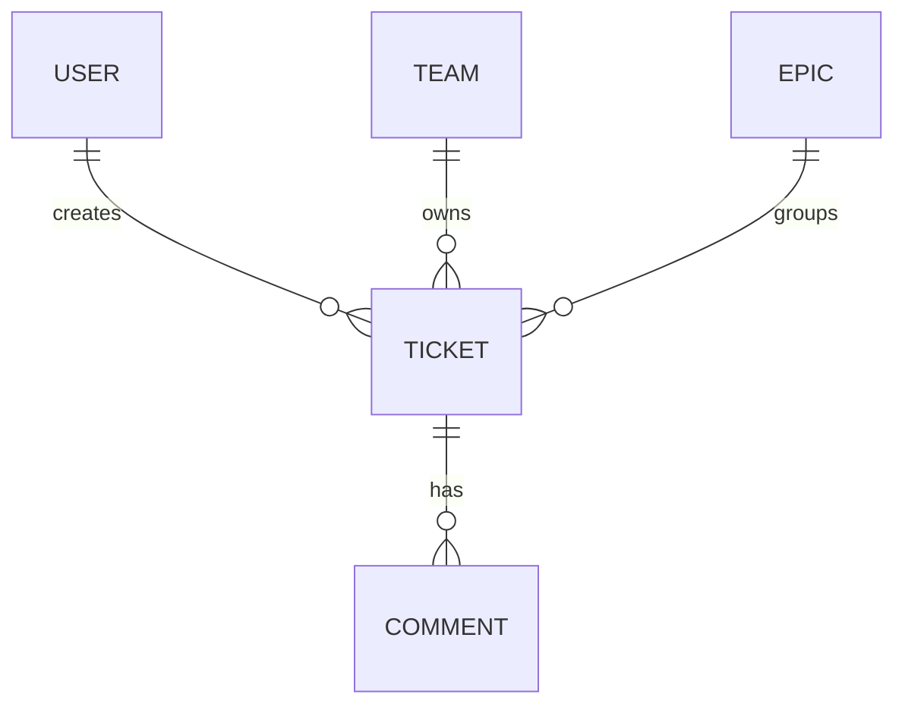

# Ticketing System High-Level Architecture

## Overview

This project is a Kanban-based ticketing system built as a 3-tier web application:



The local runtime uses Podman and `podman-compose` for the application services, database, and browser test runtime.

## Frontend

The frontend is a React single-page application built with Vite.

Core libraries:

- React
- React Router
- Zustand
- dnd-kit
- Axios

Responsibilities:

- Render the Kanban board and ticket workflows.
- Manage local UI state such as board filters, drag state, and optimistic interactions.
- Call the backend API for authentication, teams, epics, tickets, and comments.

## Backend

The backend is a REST API service.

Initial resource areas:

- Auth
- Teams
- Epics
- Tickets
- Comments

Responsibilities:

- Own application business rules and authorization.
- Validate and persist domain changes.
- Provide stable API contracts for the React SPA and test clients.
- Connect to PostgreSQL through the container network using the `db` service name.

## Database

PostgreSQL stores the application data. In local development it runs as a Podman-managed container with a named volume for persistence.

Initial conceptual entities:



## Podman Runtime

The stack is designed for rootless Podman.

Primary local services:

- `frontend`: React SPA served on host port `3000`.
- `backend`: REST API served on host port `8080`.
- `db`: PostgreSQL 15 database.
- `e2e`: optional Playwright test runner profile that launches a Chromium browser inside the Podman container.

Start the application stack:

```shell
podman-compose -f infra/podman/podman-compose.yml up --build
```

Run browser tests through Podman:

```shell
podman-compose -f infra/podman/podman-compose.yml --profile test up --build --abort-on-container-exit e2e
```
