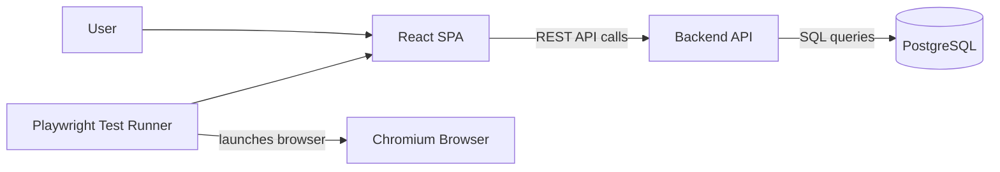
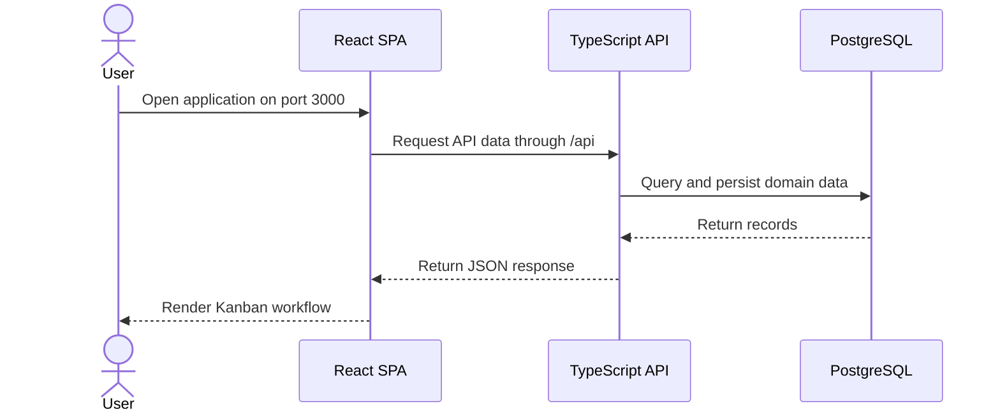
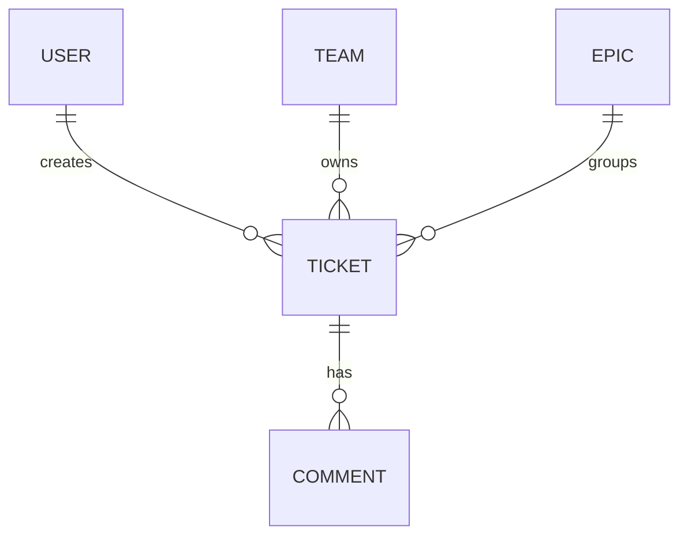

# Ticketing System High-Level Architecture

## Overview

This project is a Kanban-based ticketing system built as a TypeScript-first 3-tier web application:



The local runtime uses Podman and `podman-compose` for the application services, database, and browser test runtime.

## Current Phase

Phase numbering follows the [High Level Solution](kanban-ticketing-hls.md). Phase 0
(foundation scaffold), Phase 1 (persistence foundation & migrations), Phase 2
(authentication), Phase 3 (teams), Phase 4 (epics), Phase 5 (tickets), Phase 6 (comments),
Phase 7 (Kanban board, filtering & search), and Phase 8 (quality gates & Definition-of-Done
hardening) are complete; the next phase is Phase 9 (reference-wireframe fidelity & UX polish).

Completed:

- Created the initial repository structure for frontend, backend, infrastructure, documentation, and e2e tests.
- Added a TypeScript React SPA scaffold.
- Added a TypeScript REST API scaffold with a typed config loader, shared PostgreSQL pool, and a central error handler.
- Added PostgreSQL as the local development database.
- Added automated database migrations (`node-pg-migrate`) covering the full domain schema, applied on backend startup.
- Added a repository-root `docker compose up --build` entrypoint alongside the Podman compose configuration.
- Added Mailpit under a test profile for local email verification testing in later phases.
- Added a Vitest/Supertest backend test suite, including a migration smoke test.
- Added local authentication: email/password sign-up, Argon2id hashing, SMTP email
  verification (24h single-use tokens, resend), and login/logout with a JWT session cookie.
- Added password recovery: emailed 1h single-use reset links (`password_reset_tokens`,
  migration `0004`), with reset also confirming the email; frontend forgot/reset screens.
- Added `requireAuth` middleware protecting business endpoints, with a public allow-list for
  auth and health/readiness endpoints.
- Added Mailpit to the local stack for capturing verification emails, and frontend auth
  screens (sign-up, login, verification result, resend) with a protected board.
- Added auth unit and integration tests and a Playwright auth-flow test.
- Added team management (Phase 3): a `team-repository`/`team-service`, `/api/teams` endpoints
  behind `requireAuth` (list with a `referenced` flag, create, rename, delete), case-insensitive
  name uniqueness mapped to `409`, a referenced-delete guard, and a frontend `/teams` screen.
  Covered by backend integration tests and a Playwright teams-flow.
- Added epic management (Phase 4): an `epic-repository`/`epic-service`, `/api/epics` endpoints
  behind `requireAuth` (list with `teamName` + `referenced` and an optional `teamId` filter,
  create, edit, delete), team immutability after creation, unknown-team rejection, a
  referenced-delete guard (`409`), a reusable `assertEpicBelongsToTeam` validator for Phase 5,
  and a Tailwind-built frontend `/epics` screen. Covered by backend integration tests and a
  Playwright epics-flow.
- Added ticket management (Phase 5): a `ticket-repository`/`ticket-service`, `/api/tickets`
  endpoints behind `requireAuth` (filterable list with team/epic/author names, detail, create,
  update, delete, and a dedicated `PATCH /:id/state`), `bug|feature|fix` types and the fixed
  five-state workflow, `created_by` taken from the session, same-team epic validation (reusing
  `assertEpicBelongsToTeam`), modified-timestamp semantics (a no-op save does not bump
  `modified_at`), and comment cascade on delete. Tailwind-built `/tickets`, `/tickets/new`, and
  `/tickets/:id` screens provide the UI. Covered by backend integration tests and a Playwright
  tickets-flow.
- Added comments (Phase 6): a `comment-repository`/`comment-service`, nested
  `/api/tickets/:ticketId/comments` endpoints behind `requireAuth` (list oldest-first enriched with
  the author email, add with `author_id` from the session and a server `created_at`), `zod`
  body validation, the ticket-immutability invariant (adding a comment never bumps the ticket's
  `modified_at`), comment immutability (no edit/per-comment delete), and removal via the existing
  `ON DELETE CASCADE`. A comments section on the `/tickets/:id` screen provides the UI. Covered by
  backend integration tests and a Playwright comments-flow.
- Replaced Selenium with Playwright for browser testing.
- Documented the high-level architecture and local development workflow.

- Added Phase 8 quality gates: a backend `access-control-integration` suite (the `401`/`403`
  matrix and the `400/404/409` status-code contract), a Playwright `dod-flow` covering the full
  spec §13 journey, a GitHub Actions CI pipeline (backend + frontend + e2e), a repository-root
  `Makefile` (up / seed / verify), a generated demo dataset, and a
  [Definition-of-Done checklist](definition-of-done.md).

Not yet implemented:

- Reference-wireframe fidelity & UX polish (Phase 9).

## Technical Solution

The solution separates UI, API, data persistence, and test execution into independently containerized concerns.

- The React SPA owns browser rendering, routing, board interactions, and client-side state.
- The backend API owns business rules, validation, authorization, and persistence boundaries.
- PostgreSQL stores users, teams, epics, tickets, comments, and future audit data.
- Podman provides the local container runtime for the application stack and test execution.
- Playwright provides browser automation by launching Chromium inside the e2e Podman container.
- Runtime ports, database credentials, and test URLs are supplied through a local `.env` file based on `.env.example`.

Local service flow:



## Frontend

The frontend is a TypeScript React single-page application built with Vite.

Core libraries:

- React
- React Router
- Zustand
- dnd-kit
- Axios
- Tailwind CSS v4 (via `@tailwindcss/vite`) — utility-first styling foundation with Preflight
  enabled and a brand `@theme`; existing component classes are kept in `@layer components` so
  utilities take precedence, and screens migrate to utilities incrementally.

Responsibilities:

- Render the Kanban board and ticket workflows.
- Manage local UI state such as board filters, drag state, and optimistic interactions.
- Call the backend API for authentication, teams, epics, tickets, and comments.
- Compile TypeScript before producing the production Vite build.

## Backend

The backend is a TypeScript REST API service built on Express.

Initial resource areas:

- Auth
- Teams
- Epics
- Tickets
- Comments

Responsibilities:

- Own application business rules and authorization.
- Validate and persist domain changes.
- Provide stable API contracts for the React SPA and test clients.
- Connect to PostgreSQL through the container network using the `db` service name.
- Compile TypeScript into `dist/` for the runtime container.

## Database

PostgreSQL stores the application data. In local development it runs as a Podman-managed container with a named volume for persistence.

Initial conceptual entities:



## Podman Runtime

The stack is designed for rootless Podman.

Primary local services:

- `frontend`: React SPA served on the configured frontend host port.
- `backend`: REST API served on the configured backend host port.
- `db`: PostgreSQL 15 database.
- `e2e`: optional Playwright test runner profile that launches a Chromium browser inside the Podman container.

Runtime configuration:

- `FRONTEND_HOST_PORT` and `FRONTEND_CONTAINER_PORT` configure the frontend port mapping and Nginx listener.
- `BACKEND_HOST_PORT` and `BACKEND_CONTAINER_PORT` configure the API port mapping and backend process port.
- `POSTGRES_HOST_PORT` and `POSTGRES_CONTAINER_PORT` configure database port mapping.
- `POSTGRES_DB`, `POSTGRES_USER`, and `POSTGRES_PASSWORD` configure PostgreSQL.
- `DATABASE_URL` configures the backend database connection.
- `E2E_APP_URL` configures the Playwright test target inside the Podman network.

Start the application stack:

```shell
podman-compose -f infra/podman/podman-compose.yml up --build
```

Run browser tests through Podman:

```shell
podman-compose -f infra/podman/podman-compose.yml --profile test up --build --abort-on-container-exit e2e
```

## Change Log

Current documented changes:

- Docker wording and assumptions were replaced with Podman and `podman-compose`.
- Selenium/WebDriver was replaced with Playwright.
- JavaScript source files were replaced with TypeScript source files.
- Frontend entrypoint moved from `src/main.jsx` to `src/main.tsx`.
- Backend entrypoint moved from `src/server.js` to `src/server.ts`, compiled to `dist/server.js`.
- E2E smoke test moved from `smoke-test.js` to `smoke-test.ts`.
- Browser testing now runs inside the Playwright e2e container instead of a separate Selenium Chrome service.
- Runtime ports, database credentials, and test URLs moved from committed service definitions to local `.env` configuration.

Future planned changes:

- Add database schema migrations for users, teams, epics, tickets, and comments.
- Add authentication and authorization flow.
- Add API route modules and service layers for each domain resource.
- Add persisted Kanban board operations, including ticket creation, assignment, status changes, and drag-and-drop ordering.
- Add frontend feature modules for auth, teams, epics, board, ticket details, and comments.
- Add CI checks for TypeScript, frontend build, backend build, and Playwright smoke tests.
- Add production deployment architecture once the local runtime and application contracts stabilize.

## Delivery Plan

1. Phase 1: Foundation and runtime scaffold. Current phase, mostly complete.
2. Phase 2: Domain model and persistence. Add migrations, schema, and database access patterns.
3. Phase 3: Backend API. Implement auth, teams, epics, tickets, and comments endpoints.
4. Phase 4: Frontend workflows. Implement real Kanban workflows, routing, state, and API integration.
5. Phase 5: Test and quality gates. Expand Playwright tests, add API tests, and wire CI checks.
6. Phase 6: Deployment hardening. Add production configuration, secrets handling, observability, and release docs.
