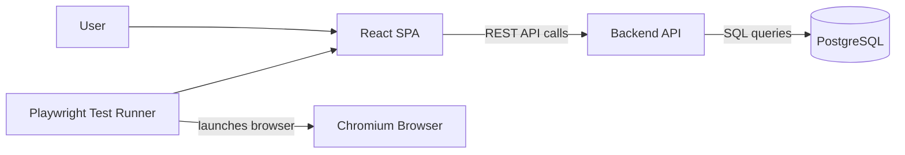
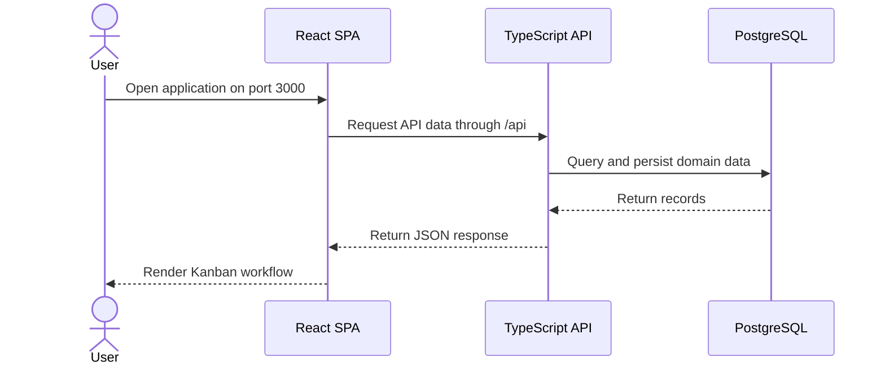
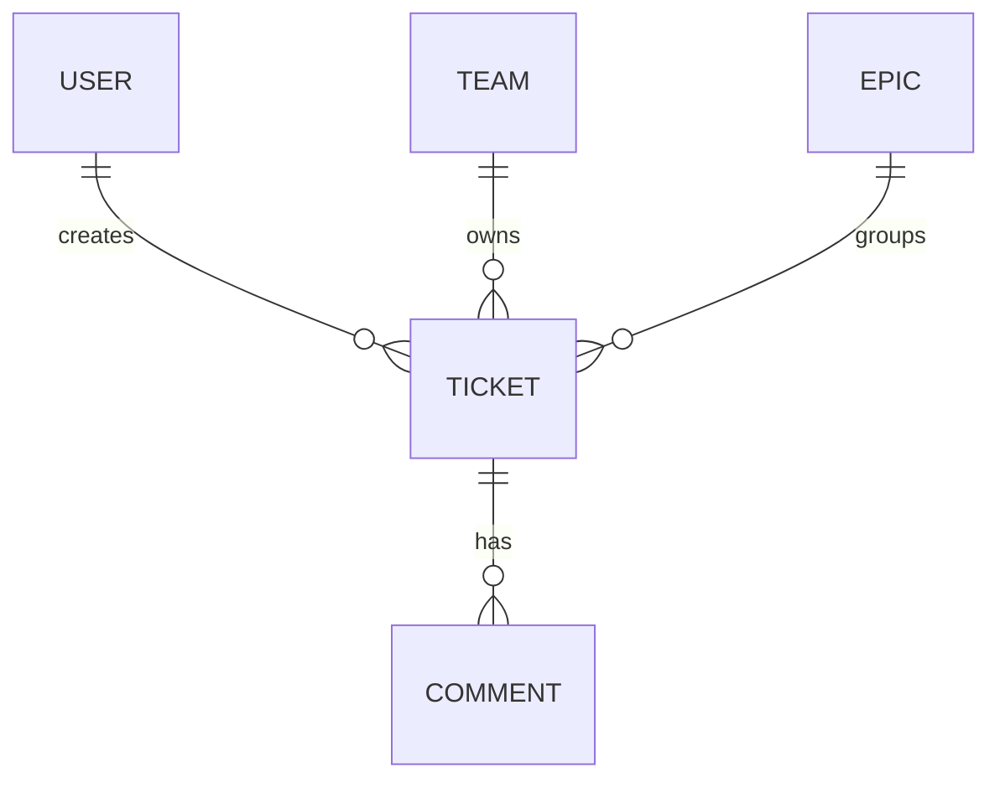

# Ticketing System High-Level Architecture

## Overview

This project is a Kanban-based ticketing system built as a TypeScript-first 3-tier web application:



The local runtime uses Podman and `podman-compose` for the application services, database, and browser test runtime.

## Current Phase

The project is in Phase 1: foundation and runtime scaffold.

Completed in this phase:

- Created the initial repository structure for frontend, backend, infrastructure, documentation, and e2e tests.
- Added a TypeScript React SPA scaffold.
- Added a TypeScript REST API scaffold.
- Added PostgreSQL as the local development database.
- Added Podman compose configuration for local runtime.
- Replaced Selenium with Playwright for browser testing.
- Documented the high-level architecture and local development workflow.

Not yet implemented:

- Authentication and authorization.
- Persistent domain models and database migrations.
- Production API endpoints for teams, epics, tickets, and comments.
- Real drag-and-drop ticket movement persistence.
- CI pipeline and release packaging.

## Technical Solution

The solution separates UI, API, data persistence, and test execution into independently containerized concerns.

- The React SPA owns browser rendering, routing, board interactions, and client-side state.
- The backend API owns business rules, validation, authorization, and persistence boundaries.
- PostgreSQL stores users, teams, epics, tickets, comments, and future audit data.
- Podman provides the local container runtime for the application stack and test execution.
- Playwright provides browser automation by launching Chromium inside the e2e Podman container.

Local service flow:



## Frontend

The frontend is a TypeScript React single-page application built with Vite.

Core libraries:

- React
- React Router
- Zustand
- dnd-kit
- Axios

Responsibilities:

- Render the Kanban board and ticket workflows.
- Manage local UI state such as board filters, drag state, and optimistic interactions.
- Call the backend API for authentication, teams, epics, tickets, and comments.
- Compile TypeScript before producing the production Vite build.

## Backend

The backend is a TypeScript REST API service built on Express.

Initial resource areas:

- Auth
- Teams
- Epics
- Tickets
- Comments

Responsibilities:

- Own application business rules and authorization.
- Validate and persist domain changes.
- Provide stable API contracts for the React SPA and test clients.
- Connect to PostgreSQL through the container network using the `db` service name.
- Compile TypeScript into `dist/` for the runtime container.

## Database

PostgreSQL stores the application data. In local development it runs as a Podman-managed container with a named volume for persistence.

Initial conceptual entities:



## Podman Runtime

The stack is designed for rootless Podman.

Primary local services:

- `frontend`: React SPA served on host port `3000`.
- `backend`: REST API served on host port `8080`.
- `db`: PostgreSQL 15 database.
- `e2e`: optional Playwright test runner profile that launches a Chromium browser inside the Podman container.

Start the application stack:

```shell
podman-compose -f infra/podman/podman-compose.yml up --build
```

Run browser tests through Podman:

```shell
podman-compose -f infra/podman/podman-compose.yml --profile test up --build --abort-on-container-exit e2e
```

## Change Log

Current documented changes:

- Docker wording and assumptions were replaced with Podman and `podman-compose`.
- Selenium/WebDriver was replaced with Playwright.
- JavaScript source files were replaced with TypeScript source files.
- Frontend entrypoint moved from `src/main.jsx` to `src/main.tsx`.
- Backend entrypoint moved from `src/server.js` to `src/server.ts`, compiled to `dist/server.js`.
- E2E smoke test moved from `smoke-test.js` to `smoke-test.ts`.
- Browser testing now runs inside the Playwright e2e container instead of a separate Selenium Chrome service.

Future planned changes:

- Add database schema migrations for users, teams, epics, tickets, and comments.
- Add authentication and authorization flow.
- Add API route modules and service layers for each domain resource.
- Add persisted Kanban board operations, including ticket creation, assignment, status changes, and drag-and-drop ordering.
- Add frontend feature modules for auth, teams, epics, board, ticket details, and comments.
- Add CI checks for TypeScript, frontend build, backend build, and Playwright smoke tests.
- Add production deployment architecture once the local runtime and application contracts stabilize.

## Delivery Plan

1. Phase 1: Foundation and runtime scaffold. Current phase, mostly complete.
2. Phase 2: Domain model and persistence. Add migrations, schema, and database access patterns.
3. Phase 3: Backend API. Implement auth, teams, epics, tickets, and comments endpoints.
4. Phase 4: Frontend workflows. Implement real Kanban workflows, routing, state, and API integration.
5. Phase 5: Test and quality gates. Expand Playwright tests, add API tests, and wire CI checks.
6. Phase 6: Deployment hardening. Add production configuration, secrets handling, observability, and release docs.
