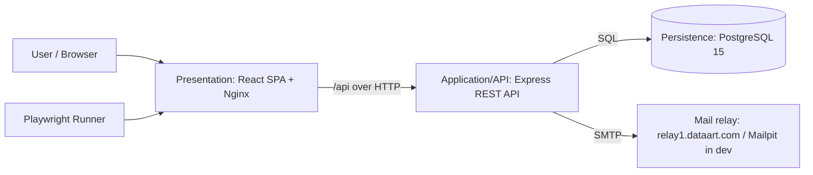

# Kanban Ticketing — High Level Solution (HLS)

This document is the high-level solution for the Kanban Ticketing System. It describes the
application's implementation **phase-by-phase**, with the technical solution for each tier,
and maps the work back to the authoritative requirements.

## Source Documents

The requirements specification **`docs/KanbanBoard.pdf` is the main and authoritative
document.** All scope, acceptance criteria, and the Definition of Done derive from it.

This HLS also consolidates the supporting docs in `./docs`:

- [KanbanBoard.pdf](KanbanBoard.pdf) — **main spec** (Hackathon Ticketing System Requirements).
- [architecture.md](architecture.md) — high-level 3-tier architecture and delivery phases.
- [testing-approach.md](testing-approach.md) — grouped end-to-end scenario catalogue.

Where this HLS and a supporting doc disagree, the PDF spec wins.

## Solution Overview

A three-tier, single-page Kanban ticket tracker backed by a relational database, runnable
from a clean checkout with a single compose command (spec §2).

Tier boundaries (spec §2 — must remain clearly separated):

- **Presentation** — React SPA, served as static assets by Nginx, which reverse-proxies
  `/api` to the backend. No business logic or persistence.
- **Application/API** — Express REST API owning validation, authorization, business rules,
  and the persistence boundary. No UI concerns.
- **Persistence** — PostgreSQL in a dedicated container with a named volume. Schema created
  only through repeatable migrations.

## Technical Stack

| Tier / Concern | Technology | Notes |
|---|---|---|
| Presentation | React + TypeScript, Vite, React Router, Zustand, dnd-kit, Axios | Built to static assets, served by Nginx 1.27 |
| Styling | Tailwind CSS v4 (`@tailwindcss/vite`) | Full framework enabled (theme + Preflight + utilities); brand tokens in `@theme`; legacy component classes kept in `@layer components` so utilities win. New screens authored utility-first; older classes migrated over time |
| Application/API | Node.js 22, Express 5, TypeScript | Layered: routes → services → repositories |
| Validation | `zod` | Server-side validation of every input (spec §9) |
| AuthN/AuthZ | `argon2` (Argon2id), `jsonwebtoken` | JWT in an httpOnly, SameSite cookie (spec §9: no tokens in URLs) |
| Email | `nodemailer` | Configurable SMTP; must support `relay1.dataart.com` (spec §3) |
| Persistence | PostgreSQL 15, `pg` (Pool) | Dedicated container, named volume |
| Migrations | `node-pg-migrate` | Repeatable; fresh DB = schema + metadata only (spec §9, §13) |
| Backend tests | `vitest` + `supertest` | Against a real Postgres |
| E2E tests | Playwright (in Podman/Docker) | Chromium headless |
| Local runtime | Podman / `podman-compose`; Docker Compose-compatible | QA must run from repo root (spec §2) |
| Dev mail capture | Mailpit (`test` profile) | Captures verification emails locally |

## Cross-Cutting Design Principles

These apply to every phase:

1. **API-first persistence (spec §9).** All create/update/delete flows go through the API
   and are persisted in PostgreSQL. The browser never acts as the system of record (no
   local-storage source of truth).
2. **Server-side validation and referential integrity (spec §9).** Enforced with DB
   constraints plus `zod`. Meaningful HTTP codes: 400 validation, 401 unauthenticated,
   403 unverified/forbidden, 404 missing, 409 conflict.
3. **Timestamps.** Server-set, stored in UTC, returned as ISO-8601.
4. **Identifiers.** UUIDs (or DB-generated values); stable and unique; never placed in URLs
   for secrets/sessions (single-use email-verification token in a URL is the only exception).
5. **Security (spec §11).** Hash passwords, protect authenticated endpoints, keep SMTP/JWT
   secrets out of source control (`.env`, ignored by Git; `.env.example` holds placeholders).
6. **Clean-checkout start (spec §2, §13).** The full stack must come up with a single
   compose command from the repository root; migrations run automatically before the API
   serves traffic; a fresh database has no application data.
7. **UX states (spec §11).** Every screen shows loading, empty, success, and error states.
8. **Wireframe awareness (spec §15).** The reference wireframes (Kanban board; login/sign-up/
   verification; ticket details/editing/comments; team management; epic management) inform
   information hierarchy and primary flows from the start. Each phase notes its wireframe
   considerations, but the dedicated **fidelity/polish pass is the final phase** — earlier
   phases prioritise correct behavior and clear structure over pixel fidelity.

---

# Phase-by-Phase Implementation

Each phase lists its goal, the spec chapters it satisfies, the per-tier technical solution,
testing, wireframe considerations, and exit criteria.

## Phase 0 — Foundation & Runtime Scaffold (complete)

- **Goal:** Establish the 3-tier containerized skeleton.
- **Spec coverage:** §2 (architecture), partial §11 (maintainability/README).
- **Delivered:** React SPA scaffold, Express API scaffold (`/api/health`, `/api/ready`,
  `/api` index), PostgreSQL 15 service, Podman compose runtime, Playwright smoke container,
  `.env`-based configuration.
- **Exit criteria (met):** stack builds and runs; tiers are separated into distinct
  containers and folders.

## Phase 1 — Persistence Foundation & Migrations (complete)

- **Status:** Done. `node-pg-migrate` applies the full schema (users, verification tokens,
  teams, epics, tickets, comments) automatically on backend startup; the backend has a typed
  config loader, shared pool, and central error handler; a repository-root `compose.yaml`
  supports `docker compose up --build`; Mailpit is available under the `test` profile; and a
  Vitest/Supertest suite (including a migration smoke test) is in place. See
  [phase-1.md](phase-1.md).
- **Goal:** Make the database authoritative and repeatable; prepare the API's layered
  structure and runtime guarantees.
- **Spec coverage:** §2, §9 (persistence/migrations), §13 (fresh DB = schema only).
- **Persistence:** introduce `node-pg-migrate`; create the initial schema migration covering
  the full domain so later phases only add data flows, not new tables:
  `users`, `email_verification_tokens`, `teams`, `epics`, `tickets`, `comments`. Use `citext`
  (or `lower()` unique indexes) for case-insensitive uniqueness; foreign keys with
  `RESTRICT`/`ON DELETE` rules that match the spec (e.g., deleting a ticket cascades its
  comments; teams/epics cannot be deleted while referenced).
- **Application/API:** add config loading/validation, a `pg` pool/query helper, a central
  error handler (status-code mapping), and a startup sequence that runs migrations **before**
  listening.
- **Runtime:** ensure a clean-checkout start; introduce a repository-root Compose-compatible
  entrypoint so QA can start everything from the root (spec §2). Add Mailpit under a `test`
  profile for later email phases.
- **Testing:** a migration smoke test confirms a fresh DB contains schema + migration
  metadata only (no application rows) — satisfies §13.
- **Wireframe considerations:** none visually; confirm the data model supports every field
  shown in the wireframes (ticket details, epic/team references).
- **Exit criteria:** migrations apply cleanly on an empty DB; API boots only after a
  successful migration; documented migration commands.

## Phase 2 — User Accounts & Authentication (complete)

- **Status:** Done. Email/password sign-up with Argon2id hashing, SMTP email verification
  (24h single-use tokens, resend via Mailpit locally / relay1.dataart.com in prod),
  login/logout with a JWT httpOnly cookie, `requireAuth` protection with a public allow-list,
  frontend auth screens with a protected board, and auth unit/integration/e2e tests. See
  [phase-2.md](phase-2.md).
- **Detailed plan:** [phase-2.md](phase-2.md).
- **Goal:** Local sign-up, email verification, login/logout, and protection of all business
  endpoints.
- **Spec coverage:** §3, §9 (auth transport, status codes), §10 (auth screens), §11
  (security).
- **Application/API:**
  - `POST /api/auth/signup` (email trimmed/lowercased/unique; password ≥8; Argon2id hash;
    create unverified user; issue single-use 24h verification token stored as a hash; send
    email).
  - `GET /api/auth/verify?token=…` (validate, expire/consume, mark verified → route to login).
  - `POST /api/auth/resend` (invalidate prior unused tokens; reissue).
  - `POST /api/auth/login` (Argon2 verify; reject unverified → 403; set JWT httpOnly cookie).
  - `POST /api/auth/logout`; `GET /api/auth/me`.
  - `requireAuth` middleware on all business routes; public allow-list: signup, login, verify,
    resend, health, readiness, static assets.
- **Email:** `nodemailer` with SMTP from env; Mailpit in dev, `relay1.dataart.com` in prod.
- **Presentation:** Sign-up, Login, Email-verification-result, and Resend screens; auth store
  via `/api/auth/me`; `<ProtectedRoute>` redirecting anonymous users to login.
- **Testing:** backend integration (signup → blocked unverified login → verify → login;
  duplicate email 409; weak password 400; expired/reused token rejected; resend invalidates
  old token); unit tests for hashing and token expiry; Playwright auth flow. Maps to
  `auth-*` scenarios in `testing-approach.md`.
- **Wireframe considerations (§15, Wireframe 2):** login/sign-up/verification layout and the
  header user menu with **Log out**.
- **Exit criteria:** a user can sign up, verify via the captured email, and log in;
  unverified users are blocked; protected endpoints reject anonymous access.

## Phase 3 — Teams (complete)

See [phase-3.md](phase-3.md) for the detailed plan, backlog, and Definition of Done.

- **Goal:** Manage teams that group tickets.
- **Spec coverage:** §4, §9, §10 (team screen).
- **Application/API (behind `requireAuth`):** `GET /api/teams`; `POST /api/teams` (trimmed,
  non-empty, case-insensitive unique → 409/400); `PATCH /api/teams/:id` (rename, bump
  `modified_at`, 404 if missing); `DELETE /api/teams/:id` (block when epics/tickets exist →
  409, no cascade).
- **Presentation:** Team management screen — list, create, inline rename, delete with
  confirmation; disabled/explained delete when referenced; surface 409 messages.
- **Testing:** backend CRUD + validation/conflict tests; Playwright `teams-*` scenarios.
- **Wireframe considerations (§15, Wireframe 4):** team list with disabled delete controls
  for referenced teams.
- **Exit criteria:** teams CRUD works and persists; referenced-team deletion is blocked with
  a clear message.
- **Status:** complete — teams CRUD, validation, conflict mapping, and the referenced-delete
  guard are implemented behind `requireAuth`, with backend integration tests and a Playwright
  `teams-flow` covering create/rename/delete.

## Phase 4 — Epics (complete)

See [phase-4.md](phase-4.md) for the detailed plan, JIRA-style backlog, and Definition of Done.

- **Goal:** Manage epics that belong to exactly one team.
- **Spec coverage:** §5, §9, §10 (epic screen).
- **Application/API (behind `requireAuth`):** `GET /api/epics?teamId=…`; `POST /api/epics`
  (team fixed at creation, title trimmed/non-empty, optional description); `PATCH /api/epics/:id`
  (edit title/description, reject team change); `DELETE /api/epics/:id` (block when referenced
  by tickets → 409). Provide a reusable "epic belongs to ticket's team" validator for Phase 5.
- **Presentation:** Epic management screen — create with team selector, list (filterable by
  team), edit, delete with confirmation; disabled/explained delete when referenced.
- **Testing:** backend CRUD + validation, team-immutability, referenced-delete tests;
  Playwright `epics-*` scenarios.
- **Wireframe considerations (§15, Wireframe 5):** epic list and create/edit form with team
  selector.
- **Exit criteria:** epics CRUD works; team is immutable post-creation; referenced-epic
  deletion is blocked.
- **Status:** complete — epics CRUD, `teamId` filter, team immutability, unknown-team rejection,
  the referenced-delete guard (`409`), the `assertEpicBelongsToTeam` validator, and a
  Tailwind-built `/epics` screen, all covered by backend integration tests and a Playwright
  epics-flow.

## Phase 5 — Tickets (complete)

See [phase-5.md](phase-5.md) for the detailed plan, JIRA-style backlog, and Definition of Done.

- **Goal:** Full ticket lifecycle with the fixed five-state workflow.
- **Spec coverage:** §6, §9, §10 (ticket create/edit/details).
- **Data model fields (spec §6):** id, team (required), type (`bug|feature|fix`), state
  (`new|ready_for_implementation|in_progress|ready_for_acceptance|done`), optional epic,
  title, body, created_at, modified_at, created_by.
- **Application/API (behind `requireAuth`):** create/read/update/delete tickets; enforce enum
  values and references server-side; epic must belong to the ticket's team; `created_by` from
  the authenticated user; `modified_at` advances only on real field/state changes (unchanged
  saves do not bump it); deleting a ticket deletes its comments; immediate persistence of
  state changes.
- **Presentation:** ticket create/edit/details view showing all fields including created_by/
  timestamps; when team changes, clear/replace an incompatible epic; explicit delete
  confirmation; loading/empty/success/error states.
- **Testing:** backend tests for required fields, invalid enums, cross-team epic rejection,
  modified-timestamp semantics; Playwright `tickets-*` scenarios.
- **Wireframe considerations (§15, Wireframe 3):** ticket details/editing layout (fields,
  metadata, actions).
- **Exit criteria:** tickets can be created, viewed, edited, and deleted with full server-side
  validation and correct timestamp behavior.

## Phase 6 — Comments (complete)

See [phase-6.md](phase-6.md) for the detailed plan, JIRA-style backlog, and Definition of Done.

- **Goal:** Threaded, immutable comments on tickets.
- **Spec coverage:** §7, §9.
- **Application/API (behind `requireAuth`):** add a comment (non-empty body; author from the
  authenticated user; created_at set by server); list comments oldest-first; comments are
  immutable in mandatory scope; adding a comment does **not** change the ticket's
  `modified_at`; comments are deleted with their ticket.
- **Presentation:** comment list (chronological) and add-comment form within ticket details;
  show author and timestamp.
- **Testing:** backend tests for empty-body rejection, chronological order, no ticket-modified
  bump, cascade-delete with ticket; Playwright `comments-*` scenarios.
- **Wireframe considerations (§15, Wireframe 3):** comments section under ticket details.
- **Exit criteria:** comments can be added and are displayed with author/timestamp; do not
  affect board ordering.
- **Status:** complete — a `comment-repository`/`comment-service`, nested
  `/api/tickets/:ticketId/comments` endpoints behind `requireAuth` (list oldest-first with the
  author email, add with `author_id` from the session and a server `created_at`), `zod` body
  validation, the ticket-`modified_at` invariant, comment immutability, and cascade removal with
  the ticket, plus a comments section on the ticket-details screen, backend integration tests, and
  a Playwright `comments-flow`.

## Phase 7 — Kanban Board, Filtering & Search (next phase)

See [phase-7.md](phase-7.md) for the detailed plan, JIRA-style backlog, and Definition of Done.

- **Goal:** The primary board screen with drag-and-drop and filtering.
- **Spec coverage:** §8, §9, §10 (board with team selector).
- **Presentation:** five fixed columns in workflow order; team selector; cards showing at
  least title and type (epic recommended); drag-and-drop between any states using dnd-kit;
  on drop, persist the new state via the API; on failure, roll the card back to its previous
  column and show an error; within a column order by most-recently-modified first; clear
  create-ticket and open-ticket actions; filtering by type and epic plus case-insensitive
  title substring search combined with AND logic; usable with ≥100 tickets per board.
- **Application/API:** efficient ticket listing per team/state; state-update endpoint persists
  immediately; optional server-side filtering/search support.
- **Testing:** Playwright `board-*`, `filters-*`, and `persistence-*` scenarios — including
  drag persistence across refresh and drag-failure rollback.
- **Wireframe considerations (§15, Wireframe 1):** the board is the primary screen; align
  column layout, card content, and create/open affordances.
- **Exit criteria:** drag-and-drop persists and survives refresh; failures roll back; filters
  and search behave per spec; board remains usable at 100+ tickets.

## Phase 8 — Quality Gates, Persistence Hardening & Definition of Done

- **Goal:** Lock in cross-cutting expectations and prove the Definition of Done.
- **Spec coverage:** §9 (API/persistence), §11 (non-functional), §13 (DoD).
- **Work:** verify referential integrity and HTTP status codes across all endpoints; confirm
  persistence survives refresh and container restart; confirm fresh DB has no seed data;
  ensure the repository-root single-command compose start works on a clean Windows/macOS/Linux
  machine; finalize automated tests covering at least one backend business flow and one
  frontend/API flow (already exceeded by earlier phases); browser-compatibility check
  (Chrome/Edge/Firefox).
- **Testing:** Playwright `access-control`, `persistence-*`, and `dod-*` scenarios
  (`dod-full-happy-path`, `dod-clean-checkout-start`, `dod-no-sample-data`).
- **Wireframe considerations:** confirm all minimum screens (spec §10) exist and are
  reachable.
- **Exit criteria:** every Definition of Done checkbox (spec §13) passes.

## Phase 9 — Reference Wireframe Fidelity & UX Polish (final)

- **Goal:** Bring the UI to the information hierarchy and flows shown in the reference
  wireframes (spec §15), and polish UX states.
- **Spec coverage:** §15 (reference wireframes), §11 (usability), §10 (screens).
- **Work:** align each screen to its wireframe — Wireframe 1 (Kanban board), Wireframe 2
  (login/sign-up/verification with header user menu + Log out), Wireframe 3 (ticket details/
  editing/comments), Wireframe 4 (team management with disabled delete controls), Wireframe 5
  (epic management). Wireframes are guidance, not a mandated visual design: a different layout
  is acceptable as long as all mandatory actions and states remain clear and usable. Refine
  loading/empty/success/error states, disabled-control affordances for referenced records, and
  overall consistency.
- **Styling:** Tailwind CSS is the foundation (Preflight on, brand `@theme`, utilities authoritative
  via `@layer components`). A good point to finish the migration — convert the remaining component
  classes in `frontend/src/styles.css` to utilities so the stylesheet is essentially just
  `@import "tailwindcss";` plus the theme.
- **Testing:** visual/flow review against wireframes; re-run the full Playwright suite.
- **Exit criteria:** all primary flows match the wireframes' intent; UX states are consistent
  across the app.

---

## Definition of Done Mapping (spec §13)

| Definition of Done item | Phase(s) |
|---|---|
| Sign up, verify via SMTP, log in | Phase 2 |
| Teams and epics managed via UI and persisted | Phases 3–4 |
| Create, view, edit, delete tickets | Phase 5 |
| Add comments with author and timestamp | Phase 6 |
| Board shows tickets in correct state columns per team | Phase 7 |
| Drag updates server and survives refresh | Phase 7 |
| Clean-checkout start via compose from repo root | Phases 1, 8 |
| No hard-coded password or committed secret | Phases 1–2, ongoing |
| Fresh DB: schema + migration metadata only | Phases 1, 8 |
| QA creates all data via UI/API, no manual DB edits | Phase 8 |

## Out of Scope (spec §12)

Scrum/sprints/backlogs/story points/velocity/burndown; SSO/OAuth/social login; fine-grained
roles, administrators, team membership, private teams, per-ticket access control; file
attachments, notifications, mentions, watchers, audit history, real-time multi-user updates;
custom workflows/types, subtasks, dependencies, time tracking, reporting dashboards;
production deployment, HA, production-grade mail infrastructure.

## Optional Stretch Features (spec §14)

Password reset; edit/delete own comments; ticket activity history; virtualized rendering for
large boards. These are deferred and only considered after the mandatory scope is complete.
